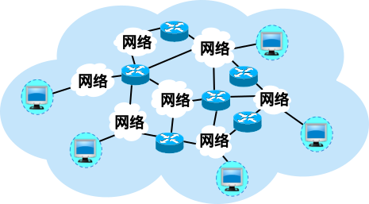

# 第一章

大众熟悉的三大类网络：
- 电信网络
- 有线电视网络
- 计算机网络 (发展最快并起到核心作用)

互联网的两个重要基本特点：
- 连通性
- 资源共享

计算机网络：由若干节点(node)和连接这些节点的链路(link)组成。

计算机网络定义：计算机网络主要是由一些通用的、可编程的硬件互连而成的，而这些硬件并非专门用来实现某一特定目的（例如，传送数据或视频信号）。这些可编程的硬件能够用来传送多种不同类型的数据，并能支持广泛的和日益增长的应用。

节点可以是计算机、集线器、交换机或路由器等。

互连网：**多个网络**通过一些路由器**相互连接**起来，构成了一个覆盖范围更大的计算机网络。

网络：网络是指将多个计算机系统连接在一起，通过通信设备和协议实现彼此之间的数据交换和资源共享的系统。

互连网：把许多网络通过一些路由器连接在一起。与网络相连的计算机常称为主机。

互连网 (internet) ≠ 互联网 (Internet)

互联网服务提供者 ISP (Internet Service Provider)

提供接入到互联网的服务。

需要收取一定的费用。

多层次 ISP 结构：

- 主干 ISP、地区 ISP 和本地 ISP。
- 覆盖面积大小和所拥有的 IP 地址数目的不同

**互联网交换点 IXP** (Internet eXchange Point)：允许两个网络直接相连并快速交换分组。

从互联网的工作方式上看，可以划分为两大块：
边缘部分： 由所有连接在互联网上的主机组成，由用户直接使用，用来进行通信（传送数据、音频或视频）和资源共享。
核心部分：由大量网络和连接这些网络的路由器组成，为边缘Q:
1. 三大类网络

计算机之间通信： 主机 A 的某个进程和主机 B 上的另一个进程进行通信。

端系统之间的两种通信方式： C/S ,P2P

- 向网络边缘中的主机提供连通性，使任何一台主机都能够向其他主机通信。
- 在网络核心部分起特殊作用的是路由器 (router)。
- 路由器是实现**分组交换** (packet switching) 的关键构件，其任务是转发收到的分组。

**分组转发是网络核心部分最重要的功能。**

典型交换技术包括：
电路交换: 建立连接-> 通话 -> 释放连接
	- 特点： 童话双方**始终占用**端到端通信资源。（资源利用率低）
分组交换：
	- 特点： 存储转发技术
报文交换 等。

互联网的核心部分采用**分组交换**技术。

分组交换的优点：
- 高效：在分组传输的过程中动态分配传输带宽，对通信链路是逐段占用。
- 灵活：为每一个分组独立地选择最合适的转发路由。
- 迅速：以分组作为传送单位，可以不先建立连接就能向其他主机发送分组。
- 可靠：保证可靠性的网络协议；分布式多路由的分组交换网，使网络有很好的生存性。

问题：
- 排队延迟：分组在各路由器存储转发时需要排队。
- 不保证带宽：动态分配。
- 增加开销：各分组必须携带控制信息；路由器要暂存分组，维护转发表等。

报文交换的问题：
- 报文交换的时延较长，从几分钟到几小时不等。

接入网 AN (Access Network)
又称为本地接入网或居民接入网。
用于将用户接入互联网。
实际上就是本地 ISP 所拥有的网络，它既不是互联网的核心部分，也不是互联网的边缘部分。
是从某个用户端系统到本地 ISP 的第一个路由器（也称为边缘路由器）之间的一种网络。
从覆盖的范围看，很多接入网还是属于局域网。

时延的组成：
（1）发送时延：从发送数据帧的第一个比特算起，到该帧的最后一个比特发送完毕所需的时间。
	发送时延 = 数据帧长度（bit） / 发送速率（bit/s）
（2）传播时延：**电磁波**在信道中传播一定的距离需要花费的时间。
	传播时延 = 信道长度(m) / 信号在信道上的传播速率(m/s)
（3）处理时延：处理分组（例如分析首部、提取数据、差错检验或查找路由）所花费的时间。
（4）排队时延：分组在路由器输入输出队列中排队等待处理和转发所经历的时延。

"在高速链路（或高带宽链路）上，比特会传送得更快些"这句话哪儿错了？
- 对于高速网络链路，我们提高的仅仅是数据的发送速率，而不是比特在链路上的传播速率。
- 提高数据的发送速率只是减小了数据的发送时延。

RTT: 表示从**发送方发送完数据**，到发送方收到来自接收方的确认总共经历的时间。

信道的利用率增大时，时延会迅速增加。

网络协议 (network protocol)，简称为协议，是为进行网络中的数据交换而建立的规则、标准或约定。
三个组成要素：
语法：数据与控制信息的结构或格式 。 
语义：需要发出何种控制信息，完成何种动作以及做出何种响应。 
同步：事件实现顺序的详细说明。

应用层：
	任务：通过应用进程间的交互来完成特定网络应用。
	协议：定义的是应用进程间通信和交互的规则。
传输层：
	任务：负责向两台主机中进程之间的通信提供通用的数据传输服务。
	具有复用和分用的功能。
	主要使用两种协议： 传输控制协议 TCP， 用户数据报协议 UDP 。
网络层：
	任务：为分组交换网上的不同主机提供通信服务。+
	两个具体任务：
	路由选择：通过一定的算法，在互联网中的每一个路由器上，生成一个用来转发分组的转发表。
	转发：每一个路由器在接收到一个分组时，要依据转发表中指明的路径把分组转发到下一个路由器。
数据链路层：
	任务：实现两个相邻节点之间的可靠通信。
	在两个相邻节点间的链路上传送帧（frame）。
	如发现有差错，就简单地丢弃出错帧。
	如果需要改正出现的差错，就要采用可靠传输协议来纠正出现的差错。这种方法会使数据链路层协议复杂。
物理层：
	任务：实现比特（0 或 1）的传输。
Q:
1. 三大类网络，哪一个是起核心作用？
2. 互联网的两个重要基本特点
3. 计算机网络概念
4. 节点都可以是什么？
5. 网络，互连网，互联网，因特网
6. ISP作用，几层，叫什么，IXP概念
7. 互联网组成
8. 计算机之间通信的本质
9. 端系统之间的两种通信方式
10. 几种交换技术？特点？路由器使用哪一个？为什么？
11. 什么是存储转发技术？
12. 路由器处理分组的过程？
13. 分组交换的优点？问题？
14. 几种不同类别的计算机网络？
15. 什么是接入网 AN ?
16. 什么是数据率/比特率？
17. 什么是带宽？频域和时域区别？
18. 吞吐量？时延？
19. 时延的组成？
20. "在高速链路（或高带宽链路）上，比特会传送得更快些"这句话哪儿错了？举例子
21. “数据的发送速率越高，其传送的总时延就越小”的说法？举例子
22. RTT
23. 信道利用率，网络利用率
24. 信道利用率越高越好吗？
25. 网络协议，以及三个组成要素
26. 应用层，传输层，网络层，数据链路层，物理层的任务分别是什么？
27. 实体，协议，服务，服务访问点