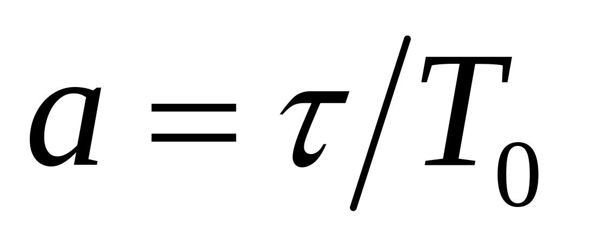

链路 (link) ：
	一条无源的点到点的物理线路段，中间没有任何其他的交换结点。
	一条链路只是一条通路的一个组成部分。
	或物理链路。
数据链路 (data link)：
	把实现控制数据传输的协议的硬件和软件加到链路上，就构成了数据链路。
	或逻辑链路。
	典型实现：适配器（即网卡）
帧：链路层协议数据单元，封装网络层的数据报。

三个基本问题：
1. 封装成帧
2. 透明传输
3. 差错控制

纠错码（error-correcting code）：主要用于错误发生比较频繁的信道上，如无线链路
检错码（error-detecting code）：主要用在高可靠、误码率较低的信道上，例如光纤链路


CRC（循环冗余校验）中，除数（生成多项式）是事先确定的，并且在通信的双方必须使用相同的生成多项式来进行计算和检测。

在CRC（循环冗余校验）中，除数（也称为生成多项式或多项式除数）是事先确定的固定多项式。该多项式决定了特定的CRC算法如何计算冗余码。生成多项式是一种标准，它决定了计算和检查过程中使用的数学规则。

### 确定生成多项式的方法

1. **标准化多项式**：生成多项式通常是标准化的，并且对于不同的应用和协议，有不同的标准生成多项式。以下是一些常见的生成多项式：
   - CRC-8: \( x^8 + x^2 + x + 1 \)（对应二进制表示 100000111）
   - CRC-16: \( x^{16} + x^{15} + x^2 + 1 \)（对应二进制表示 11000000000000101）
   - CRC-32: \( x^{32} + x^{26} + x^{23} + x^{22} + x^{16} + x^{12} + x^{11} + x^{10} + x^8 + x^7 + x^5 + x^4 + x^2 + x + 1 \)（对应二进制表示 100000100110000010001110110110111）

2. **选择多项式**：选择生成多项式时，通常考虑以下因素：
   - **检测能力**：不同的生成多项式具有不同的错误检测能力。某些多项式能够更好地检测到单个错误、双重错误、奇数错误等。
   - **性能**：不同的多项式可能在计算复杂性和硬件实现上有所不同。一些多项式可能更适合特定的硬件或软件环境。
   - **应用需求**：不同的应用可能有不同的需求，例如以太网、USB、无线通信等，它们都有各自的标准生成多项式。

### CRC计算过程

1. **原始数据准备**：将原始数据按位表示，假设原始数据为\(k\)位，冗余码为\(n\)位。
2. **数据扩展**：在原始数据后面附加\(n\)个0，形成一个新的数据串。
3. **多项式除法**：用生成多项式对扩展后的数据串进行二进制模2除法（即不借位的二进制除法），得到的余数即为CRC码。
4. **附加CRC码**：将CRC码附加到原始数据后，形成传输数据。

### CRC校验过程

1. **接收数据**：接收数据包含原始数据和CRC码。
2. **多项式除法**：用相同的生成多项式对接收的数据进行二进制模2除法。
3. **校验结果**：如果余数为0，则数据无误；否则数据存在错误。

### 例子：CRC-4

假设原始数据是1101，生成多项式是\(x^4 + x + 1\)（即10011）。

1. **数据扩展**：原始数据1101变为11010000。
2. **多项式除法**：用10011对11010000进行二进制模2除法。

   ```
   11010000 (被除数)
   10011    (除数)
   ----------
   10011    (第一次减法)
   10000
   10011    (第二次减法)
   00111
   00000
   ----------
   00111
   ```

3. **余数**：余数是0011，这就是CRC码。

PPP协议 三个组成部分：
一个将 IP 数据报封装到串行链路的方法。
一个链路控制协议 LCP (Link Control Protocol)
	m用来建立、配置和测试数据链路的链路控制协议，通信双方可协商一些选项，最重要的功能之一是身份验证。 
一套网络控制协议 NCP (Network Control Protocol)
	其中每个协议支持一种不同的网络层协议，如IP、OSI的网络层、DECnet、AppleTalk等。
PPP协议是面向字节的。

透明传输问题 

当 PPP 用在异步传输时，使用字节填充法。
	异步传输：面向字节的传输，异步传输的单位是字符；异步传输效率低，高速链路开销大。

当 PPP 用在同步传输链路时，采用零比特填充法。  
	同步传输（SONET/SDH链路）：面向比特的传输，同步传输的单位是帧；同步传输收发双时钟统一、字符间传输同步无间隔。

例题： 一个PPP帧的数据部分(用十六进制写出)是7D 5E FE 27 7D 5D 7D 5D 65 7D 5E。试问真正的数据是什么(用十六进制写出)?  

答案：7E FE 27 7D 7D 65 7E

0 1 1 1 | 1 1 1 0
问题是：可能会出现 0x7E，根据6个连续1的这个特点，解决方案：

发送端在 5 个连 1 之后填入比特 0 再发送出去
接收端把 5 个连 1 之后的比特 0 删除

PPP 链路初始化过程：
	- 用户拨号接入 ISP 后，就建立了一条从用户个人电脑到 ISP 的物理连接。
	- 用户个人电脑向 ISP 发送一系列的链路控制协议 LCP 分组（封装成多个 PPP 帧），以便建立LCP连接。
	- 之后进行网络层配置。网络控制协议 NCP 给新接入的用户个人电脑分配一个临时的 IP 地址。
	- 当用户通信完毕时，NCP 释放网络层连接，收回原来分配出去的IP地址。LCP 释放数据链路层连接。最后释放的是物理层的连接。

以太网
	采用较为灵活的无连接的工作方式
	发送的数据都使用曼彻斯特编码（所占的频带宽度比原始的基带信号增加了一倍）

CSMA/CD 协议：

最早的以太网：将许多计算机都连接到一根总线上。
总线特点：易于实现广播通信，简单，可靠。
	为了实现一对一通信，将接收站的硬件地址写入帧首部中的目的地址字段中。仅当数据帧中的目的地址与适配器硬件地址一致时，才能接收这个数据帧。

	- 多点接入：说明这是总线型网络。许多计算机以多点接入的方式连接在一根总线上。
	- 载波监听：即“ 边发送边监听”。不管在想要发送数据之前，还是在发送数据之中，每个站都必须不停地检测信道。
	- 碰撞检测：适配器边发送数据，边检测信道上的信号电压的变化情况。电压摆动值超过一定的门限值时，就认为总线上至少有两个站同时在发送数据，表明产生了碰撞（或冲突）
[4](./4.png)

争用期：
	以太网的端到端往返时延 2  称为争用期，或碰撞窗口。
	具体的争用期时间 = 51.2 μs。
碰撞后重传的时机：
	基本退避时间 = 2 
	重传所需的时延 =  r ⅹ 基本退避时间。
	当重传达 16 次仍不能成功时即丢弃该帧，并向高层报告。

	第 1 次冲突重传时：
	    k = 1，r  为 {0，1} 集合中的任何一个数。
	第 2 次冲突重传时：
	    k = 2，r  为 {0，1，2，3} 集合中的任何一个数。
	第 3 次冲突重传时：
	    k = 3，r  为 {0，1，2，3，4，5，6，7} 集合中的任何一个

**最短有效帧长为 64 字节。凡长度小于 64 字节的帧都是由于冲突而异常中止的无效帧，应当立即将其丢弃。**

**以太网最大端到端单程时延必须小于争用期的一半 (即 25.6 μs)，相当于以太网的最大端到端长度约为 5 km。**

强化碰撞：人为干扰信号
	发送站检测到冲突后，立即停止发送数据帧，接着就发送 32 或 48 比特的人为干扰信号。
[5](./5.png)

成功发送一个帧需要占用信道的时间是 T0 + τ ，得包含传播过程呀！所以比帧的发送时间要多一个单程端到端时延 τ 。



	a → 0，表示一发生碰撞就立即可以检测出来， 并立即停止发送，因而信道利用率很高。
	a 越大，表明争用期所占的比例增大，每发生一次碰撞就浪费许多信道资源，使得信道利用率明显降低。 


48位 MAC 地址 含义： 3字节 组织唯一标识符 + 3字节 扩展唯一标识符
第 1 字节的最低位为 I/G (Individual / Group) 位。
 	单站地址：I/G 位 = 0。
 	组地址：I/G 位 = 1。组地址用来进行多播。
 	广播地址：所有 48 位都为 1（全 1）。只能作为目的地址使用。

IP数据包长度为什么是 46 - 1500 字节？
	目的地址 6 字节 + 源地址 6 字节 + 类型 2 字节 + 46 字节 + FCS 4 字节

以太网 MAC 帧 前面还要插入 8 字节（7字节 同步码 + 1 字节 帧开始定界符）

碰撞域 ：
	碰撞域（collision domain）又称为冲突域，指网络中一个站点发出的帧会与其他站点发出的帧产生碰撞或冲突的那部分网络。
	**碰撞域越大，发生碰撞的概率越高。**
集线器：
	优点
		使原来属于不同碰撞域（冲突域）的计算机能够跨碰撞域通信。
		扩大了以太网覆盖的地理范围。
	缺点
		碰撞域增大了，总的吞吐量未提高。
		如果使用不同的以太网技术（如数据率不同），那么就不能用集线器将它们互连起来。 
网桥（软件转发）：
	优点
		过滤通信量。
		扩大了物理范围。
		提高了可靠性。
		互连不同物理层、不同MAC子层和不同速率的局域网
	缺点
		时延增加，对帧要先存储、查表再转发；
		局域网MAC层无流量控制。缓存溢出会产生帧丢失。
		具有不同MAC子层的网段桥接时，必须修改帧结构，增加时延。
		网桥只适合于用户数不太多(不超过几百个)和通信量不太大的局域网，否则有时会产生广播风暴。
以太网交换机
	本质上是多接口网桥
	全双工，并行，有存储器，帧交换表是通过自学习算法自动建立起来的，硬件实现转发
	每个用户独享贷款，增加总容量

	工作方式：
		存储转发方式：把整个数据帧先缓存，再进行处理。
		直通 (cut-through) 方式：接收数据帧的同时立即按数据帧的目的 MAC 地址决定该帧的转发接口。

虚拟局域网限制了接收广播信息的工作站数，使得网络不会因传播过多的广播信息 (即“广播风暴”) 而引起性能恶化。 

虚拟局域网（VLAN）技术具有以下主要优点：
	改善了性能
	简化了管理
	降低了成本
	改善了安全性

划分局域网的方法：
	基于交换机端口
	基于计算机网卡的 MAC 地址
	基于协议类型
	基于 IP 子网地址
	基于高层应用或服务


Q:
1. 帧，链路，数据链路
2. 链路层三个基本问题
3. CRC 循环冗余检验原理，如何计算的？
4. FCS 是什么？
5. "无比特差错"和"无传输差错"的不同？
6. PPP 协议作用，组成？它面向字节还是比特？
7. PPP协议在不同的传输场景下，分别使用什么方法，具体方法解决方案讲解
8. PPP协议的工作全流程
9. LLC 和 MAC 作用
10. CSMA/CD 协议，要点
11. 争用期，碰撞后重传的时机
12. 以太网最大端到端长度，最短帧
13. 成功发送一个帧需要占用信道的时间是 T0 + τ ，比帧的发送时间要多一个单程端到端时延 τ 。为什么？
14. MAC地址含义
15. IP数据包长度为什么是 46 - 1500 字节？
16. 什么是碰撞域？什么是广播域？
17. 集线器，网桥，以太网交换机优点缺点
18. 以太网交换网自学习功能，具体交换表如何添加，如何解决回环？
19. 什么是广播风暴？
20. VLAN 是什么？优点？