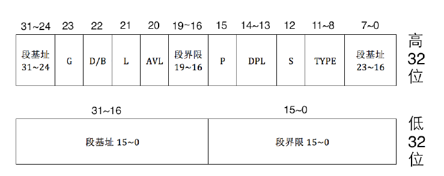
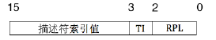
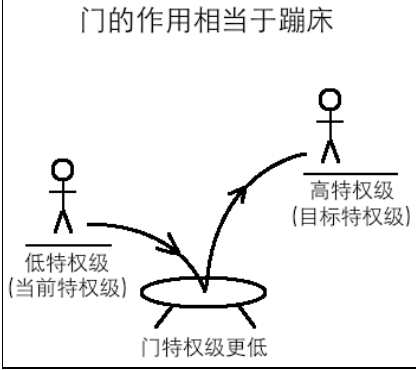
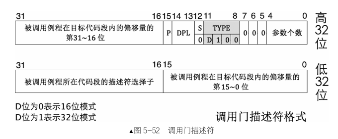
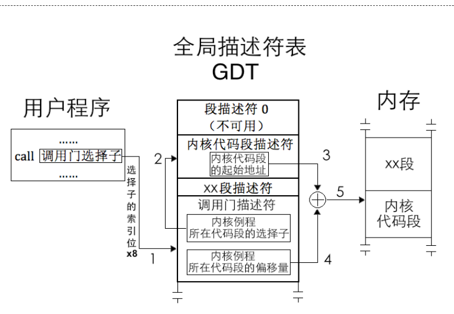
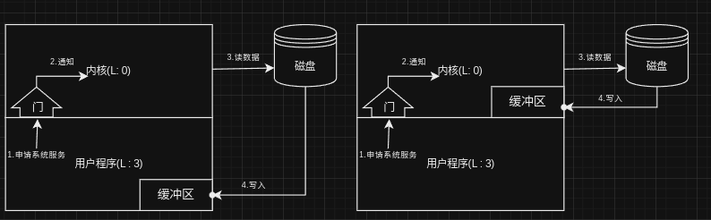

# 前言

- 实验环境:Archlinux + Bochs x86 Emulator 2.7
- 编译器: nasm

**---以下均是我的个人笔记,如有错误,敬请指正.---**
<!-- more -->
# DPL

DPL全称是`Descriptor Privilege Level`,描述符特权级.这里是在保护模式设置段描述符的时候进行确认的,比如内核d代码段的特权级别是0,用户程序代码段的特别级别是3,这是在设置描述符的时候就确定的.我还是在此解释一下什么是描述符.

## 1. 什么是描述符

要解释描述符就要解释什么是实模式什么是保护模式,真是一路修到发电厂...

### 1.1 实模式与保护模式

#### 实模式为什么危险
计算机的世界只有0和1,而这些0和1被人为划定为指令和数据,CPU是比较傻的,它并不知道指令和数据的区别,它就像一个完全服从的士兵一样,你想让它干什么它就干什么.即使你在实模式下一不小心让CPU执行本该属于数据的地方,它也会自己说服自己,将数据强行理解成指令.也许你听起来比较懵,事实的确如此,我们简单来写一个汇编demo,不要害怕,即使你没有学习过汇编语言,相信在我的注释下你也能看懂,放码:
```asm
; 文件名: mbr.S
MBR_BASE_ADDR equ 0x7c00	; 类似于C语言的define宏定义,编译期间进行替换
org	MBR_BASE_ADDR			; org 指令告诉汇编器将代码放置在指定的内存地址处
    ; jmp code				; jmp 翻译:跳,跳到code那里运行
data:
    _var1 dw 0x55			; 定义了一个名为 _var1 的 16 位（即 2 字节）数据，初始值为 0x55
    _var2 dw 0x00			; 同理
code:
    mov ax,0				; 下面都是具体命令,我们此时不关心具体是什么指令
    mov ds,ax
    mov ss,ax
    mov esp,0x7c00
    push ax
    jmp $
    times 510 - ($ - $$) db 0 ; 由于运行环境是bochs的主引导程序,额外需要,此处不关心
    db 0x55,0xaa
```
代码从头开始运行(宏定义肯定没了),从第三行开始运行,我们来看调试过程:
```
<bochs:1> b 0x7c00
<bochs:2> c
(0) Breakpoint 1, 0x00007c00 in ?? ()
Next at t=17178866
(0) [0x000000007c00] 0000:7c00 (unk. ctxt): push bp                   ; 55
<bochs:3> n
Next at t=17178867
(0) [0x000000007c01] 0000:7c01 (unk. ctxt): add byte ptr ds:[bx+si], al ; 0000
<bochs:4> n
Next at t=17178868
(0) [0x000000007c03] 0000:7c03 (unk. ctxt): add byte ptr ds:[bx+si], bh ; 00b80000
<bochs:5> n
Next at t=17178869
(0) [0x000000007c07] 0000:7c07 (unk. ctxt): mov ds, ax                ; 8ed8
<bochs:6> n
Next at t=17178870
(0) [0x000000007c09] 0000:7c09 (unk. ctxt): mov ss, ax                ; 8ed0
<bochs:7> n
Next at t=17178871
(0) [0x000000007c0b] 0000:7c0b (unk. ctxt): mov esp, 0x00007c00       ; 66bc007c0000
<bochs:8> n
Next at t=17178872
(0) [0x000000007c11] 0000:7c11 (unk. ctxt): push ax                   ; 50
<bochs:9> n
Next at t=17178873
(0) [0x000000007c12] 0000:7c12 (unk. ctxt): jmp .-2  (0x00007c12)     ; ebfe
```
相信大家看到了,这里多出来了我们没有写的指令`push bp`,`add byte ptr ds:[bx+si], al`和`add byte ptr ds:[bx+si], bh`,而且少了`mov ax,0`,再看调试过程最右侧的机器码,很明显,我们的`_var1`和`_var2`被当成了指令来执行,而这不符合我们代码的预期.
将注释的`jmp code`语句加上后,我们再来调试一下:
```
<bochs:1> b 0x7c00
<bochs:2> c
(0) Breakpoint 1, 0x00007c00 in ?? ()
Next at t=17178866
(0) [0x000000007c00] 0000:7c00 (unk. ctxt): jmp .+4  (0x00007c06)     ; eb04
<bochs:3> n
Next at t=17178867
(0) [0x000000007c06] 0000:7c06 (unk. ctxt): mov ax, 0x0000            ; b80000
<bochs:4> 
Next at t=17178868
(0) [0x000000007c09] 0000:7c09 (unk. ctxt): mov ds, ax                ; 8ed8
<bochs:5> 
Next at t=17178869
(0) [0x000000007c0b] 0000:7c0b (unk. ctxt): mov ss, ax                ; 8ed0
<bochs:6> 
Next at t=17178870
(0) [0x000000007c0d] 0000:7c0d (unk. ctxt): mov esp, 0x00007c00       ; 66bc007c0000
<bochs:7> 
Next at t=17178871
(0) [0x000000007c13] 0000:7c13 (unk. ctxt): push ax                   ; 50
<bochs:8> 
Next at t=17178872
(0) [0x000000007c14] 0000:7c14 (unk. ctxt): jmp .-2  (0x00007c14)     ; ebfe
```
此时就完全正确了,在早期实模式下,更可怕的是没有限制的自由,你想访问哪儿都可以,想改变指定内存的数据都是可以的,程序A的数值被程序B就可以随意更改,甚至更改程序A的代码运行逻辑,这是很可怕的,所以就有了保护模式.

#### 保护模式

当时急需对电脑中的程序有特权等级的划分,以及代码段,数据段等等的限制,段属性,段基址,段界限,为了提高电脑运行时候的安全性:如果CPU不小心运行到数据段就报错,用户程序试图修改不属于自己的段信息就会报错,这样安全程度就会大大提高,上述需求的实现均基于一种数据结构:段描述符.段描述符通常由一组16字节的数据表示，包含了内存段的各种属性和控制信息.下面是x86-32位下的段描述符的结构:



我们来看看具体的描述符初始化的环境:
```asm
; 文件名 : test.S 
; 编译指令 : nasm test.S -f bin -o test.bin
 DA_DRW		equ	92h	; 存在的可读写数据段属性值
 DA_DPL3		equ	  60h	; DPL = 3
 ; 描述符的宏实现
 ; usage: Descriptor Base, Limit, Attr
 ;        Base:  dd
 ;        Limit: dd (low 20 bits available)
 ;        Attr:  dw (lower 4 bits of higher byte are always 0)
 %macro Descriptor 3
 	dw	%2 & 0FFFFh				; 段界限 1				(2 字节)
 	dw	%1 & 0FFFFh				; 段基址 1				(2 字节)
 	db	(%1 >> 16) & 0FFh			; 段基址 2				(1 字节)
 	dw	((%2 >> 8) & 0F00h) | (%3 & 0F0FFh)	; 属性 1 + 段界限 2 + 属性 2		(2 字节)
 	db	(%1 >> 24) & 0FFh			; 段基址 3				(1 字节)
 %endmacro ; 共 8 字节
 ; 下面来看一个具体的使用
 LABEL_DESC_DATA:		Descriptor	           0,             0FFFFh, DA_DRW + DA_DPL3					; Data
```
动手强的可以来编译看一看,我这里也不卖关子,直接给结果:


x86是小端序,这里的机器码转换成上面表格的格式来看,可以看到特权级的确为3.
```
00 00 f2 00 // 高32位
00 00 ff ff // 低32位
```

# RPL

RPL全称是`Request Privilege Level`,请求特权级.还记得刚刚说的段描述符吗?段描述符是在内存中的,而且你也看到了这里面段基址,段界限,以及各种属性看起来比较不符合常理,这实际上是为了兼容以前的老古董处理器,Intel公司能有现在的规模,对以前处理器的兼容功不可没,但是兼容归兼容,这鬼东西总不能我用一下就去内存里面整合计算一下吧,即使有很好的代码逻辑进行封装,调用起来很方便,这也是一件很离谱的事情,为什么呢?**效率**.

内存很快吧?相对于网络和磁盘罢了,跟CPU的速度相比就慢太多了,而跟CPU内部的`L1 L2 L3`缓存以及寄存器相比就慢太多了,为了保护模式我们能更高效的使用段描述符,我们也急需一个缓存机制来让段描述符和寄存器的效率相当(比如代码描述符,运行一次就要用一次来进行判断有没有越界(跑到数据区)等),能和寄存器效率相当的当然是寄存器.我们在实模式下使用:`段地址:偏移地址` 进行寻址,保护模式下使用的是`段选择子:偏移地址`.寄存器是很值钱的,巴不得一个掰两个用,就将实模式下存储段地址的段寄存器用来存储段选择子.

## 2.1 段选择子

段寄存器有缓存机制,且不给程序员开放.段寄存器的缓存是一种用于提高内存访问效率的技术，它允许 CPU 在一段时间内缓存最近访问的段描述符.这些寄存器存储了当前正在执行的指令所在的代码段、数据段等信息.我们可以通过改变段寄存器的选择子来缓存新的段描述符.(希望我说清楚了)

段选择子的结构:


我们可以看到其由三部分构成:描述符索引值(与段描述符是一一映射),TI(GDT表还是LDT表),RPL(终于到正题了).

**请求**,能够**请求**计算机资源的是什么?指令呀!你总不能指望你定义的一个int型数据请求计算机资源吧.**只有指令才有访问,请求其他资源的能力**.所以cs段寄存器段选择子的`RPL`位表示代码请求别人资源的特权等级,由于cs:eip指向的指令是CPU正在执行的,也称处理器的当前特权级是CS.RPL.至于为什么会有RPL,后面的调用门会zhen

# CPL

RPL全称是`Current Privilege Level`,当前特权级.这里你肯定纳闷了,非要单独整个`CPL`,这不就是cs段寄存器段选择子的`RPL`,这话是对的,但不完全对.

为什么这么说呢?它既然没有被淘汰那么一定有自己的道理.还记得我们刚刚说的那句话:**只有指令才有访问,请求其他资源的能力**.访问者任何时刻访问比自己特权级高的资源都是违法的.无论是数据还是代码.在不涉及RPL的前提下我们分类讨论一下:

### 数据段

只有访问者的权限大于等于该 DPL 表示的最低权限才能够继续访问,否则连这个门槛都迈不过去.比如,DPL 为 1 的段描述符,只有特权级为 0、1 的访问者才有资格访问它所代表的资源,特权为 2、3的访问者会被 CPU 拒之门外.

数据段不允许被比本数据段特权级别更低的代码段访问.

### 代码段

先说结论:只有访问者的权限**等于**该代码段的DPL表示的**最低权限**才能访问.说人话就是只能平级访问,高特权级或者低特权级都不能访问.对于受访者是代码段,实际上是处理器从当前代码段跳到受访代码段上执行,并不是将其当作**数据**处理.的.

为什么高特权级也不能访问?比如当前代码段特权级是0,被访问代码段特权级是3,特权级3能做的事情,特权级0不能干吗?特权级高的代码不需要低特权代码的帮助.这里我其实也没有很清楚,单这个理由还不能说服我....个人感觉可能为了安全考虑,操作系统默认是对应用程序不信任的,不能以高特权级来运行应用程序....

当然也有特例,处理器唯一一种从高特权级到低特权级的情况:处理器从中断处理程序中返回到用户程序.因为中断处理程序一般是需要访问硬件,而只有特权级是0的时候可以访问硬件.

没有发现这种情况下只能平级跳跃,那么该如何运行特权等级低或者高的代码呢?我们不得不佩服先人的智慧,处理器为此提供了多种方法用于从低特权级别代码转移到高特权级代码**且不提升特权级**.

1. 依从性代码(一致性代码):非系统段的前提下,可以用type字段的C位来表示是否是一致性代码.一致性代码是指如果自己是被转移的目标,则自己的DPL一定要大于等于转移前的CPL.为什么叫依从性代码,是因为其依从改变前代码段的特权级(低的特权级).
2. 使用门.

# 门

**门**（Gate）是另一种形式的描述符，称为门描述符，简称门.和段描述符不同，段描述符用于描述内存段，门描述符则用于描述可执行的代码，比如一段程序、一个过程（例程）或者一个任务.

门的类型，根据用途不同，分为调用门、中断门/陷阱门、任务门.

调用门：用于不同特权级之间的过程调用；可放在GDT,LDT

中断门/陷阱门：用于中断处理过程使用；可放在IDT

任务门：对应单个任务，用来执行任务切换.可放在GDT,LDT,IDT

任务门、调用门都可以用 call 和 jmp 指令直接调用,原因是这两个门描述符都位于描述符表中,要么是 GDT,要么是 LDT,访问它们同普通的段描述符是一样的,也必须要通过选择子,因此只要在 call 或jmp 指令后接任务门或调用门的选择子便可调用它们了.陷阱门和中断门只存在于 IDT 中,因此不能主动调用,只能由中断信号来触发调用.


RPL的产生就是为了解决系统调用越权问题,系统调用的实现中,调用门(现在更多的是中断门)和中断门最为合适.当程序使用门进行特权级别的转换或跳转时，处理器会比较段选择子中的RPL字段和目标门描述符中的DPL字段.只有当RPL字段不低于DPL字段时，才允许特权级别的转换或跳转.换句话说，RPL提供了一种请求特权级别的机制，而门描述符的DPL则控制了对应门的访问权限.


## 调用门

调用门是一个描述符,称为门描述符,存储在GDT或者LDT中,虽然该数据结构是在分段机制时候使用,现在的操作系统大多不是用调用门,更多使用的是中断门来实现函数调用,但我们还是来学习一下先人的智慧.通常调用门是通过call或者jmp后面接调用门的段选择子(GDT,LDT表,肯定有段选择子)来使用的.调用门只能向**平级**或者**更高级**转移,**只有`retf`和`iret`才能由高特权级到低特权级.**,这句话一会就会用到,我们先来看一下调用门的结构:



可以看到其存储了被调用例程的选择子,以及其偏移量.那么具体执行流程如下图所示:



解释的很清楚我就不赘述,现在有两个问题:
1. 如果我`call`或者`jmp`指定调用门描述符选择子时,后面接偏移地址会发生什么?比如`call gate:0x123`.
2. 我进入对应函数调用的时候,我该如何传入参数?
对于第一个问题:什么都不会发生,CPU会自行忽略后面的偏移地址.
对于第二个问题:假设我当前特权级是3,函数调用是0.而不同特权级都会有各自的栈,我用户没资格给0特权级的栈压入参数.这不就出问题了嘛?还是那句话:兵来将挡 水来土掩.回过头看调用门结构中,有一个"参数个数",最多可以传入31(2^5 - 1)个参数.由于用户没权限,所以处理器在硬件层次做了自动拷贝.

### 调用门过程的保护

假设现在有一个特权级为3的程序通过调用门调用特权级为0的系统调用,门描述符中的参数个数为2.为了方便特权级为3的SS和ESP后加`_3`,特权级为0同理.
执行流程:
1. 目前的特权级为3,分别将两个参数压入当前特权级栈中.
2. 确定新特权级使用的栈,根据门描述符中的选择子对应的目标代码段的DPL(0),在TSS中查找正确的栈段选择子SS和栈指针ESP.将其作为转换后的新栈.
3. 检查新栈段选择子的DPL,TYPE等,如果出错则异常处理.
4. 我们需要清楚门调用完成后还是需要返回至低特权级的,0特权级后是需要保存SS_3和ESP_3的.所以处理器暂存SS_3和ESP_3.且切换步骤2得到的SS_0和ESP_0.
5. 切换完成后,将SS_3和ESP_3存入0特权级的栈中(处理器资源很珍贵,况且如果有很多调用门呢?总不能全塞处理器里面把),然后处理器硬件层次将步骤1的两个参数拷贝进当前的栈空间.
6. 不仅仅要存储SS_3和ESP_3,还要存储CS_3和EIP_3,即使使用同一个选择子或者两个选择子使用同一个段也要存储(只要段寄存器被加载,内部缓存都会被刷新,相当于段间远转移,所以需要拷贝CS和EIP).
7. 加载门描述符中存储的段选择子到CS中,偏移量加载到EIP中.

这里需要注意的是:如果步骤2发现是平级转移,则不需要存储SS和ESP,以及栈的切换,直接将CS和EIP压栈即可.

还记得上面加粗的话嘛:**只有`retf`和`iret`才能由高特权级到低特权级.**.还是那句话,CPU是很傻的,它是被所有任务共享的,也就是说它根本不知道它刚刚从调用门来提权执行特权级为0的代码,它也不知道它此时应该回到低特权级的地方.此处就用到了`retf`.处理器不知道自己是从调用门上来的,但是它有权怀疑自己到底是不是从调用门过来的,为以防万一,它从调用门回来时也要做特权级检查.

执行完回低特权级的流程:
1. 当处理器执行到`retf`指令时,它知道这是远返回,所以需要从栈中返回旧栈的地址及返回到低特权级的程序中。这时候它要进行特权级检查。先检查栈中CS选择子,根据其`RPL`位,即未来的`CPL`,判断在返回过程中是否要改变特权级.
2. 进行特权级检查,通过后,弹出栈中数据,EIP设置为EIP_3,CS设置为CS_3,此时ESP_0指向最后一个参数.
3. 如果`retf`指令后有参数,则增加ESP_0的数值,为了跳过栈中参数.所以`retf + A`,A = 压入的参数个数 * 压入的参数数量.此时ESP_0指向ESP_3.
4. 如果步骤1判断出来需要改变特权级,弹出栈中数据,将ESP设置为ESP_3,SS设置为SS_3.

这里需要注意的是:由于在特权级为0时候,可能将ds,es,fs等段寄存器其中某些设置为特权级来使用了,但是`retf`后并没有更改回去,且处理器就会将其(段寄存器的DPL > CPL)修改为0.这里就解释了为什么GDT表要专门留一个NULL,从而出发处理器异常,本质上就是为了安全,防止出现漏洞.听着很不可思议吧.怎么会有这样的设计.所以linux使用中断门自己实现了一套更高效的上下文切换.

### 调用门的弊端(RPL的必要性)

正常情况下仅仅靠DPL和CPL好像也不是不行?的确是这样的.但是吧应用程序也存在恶意程序,比如使用调用门实现memcpy的功能,参数是:数据源所在段的段选择子以及偏移地址,目的所在段的段选择子以及偏移地址,拷贝的字节数量.



我们先来看左侧调用，正常使用一切安好，但是，如果传入的内核数据源所在段的选择子以及内核的偏移地址呢？这并不是不可能的，GDT表中元素没有很多，暴力一个个尝试也不是不可以。这不就将内核的数据拷贝进了用户的缓冲区，相当于用户可以访问内核才能访问的数据。

再看右侧的调用，右侧本身是不可行的，也是通过暴力尝试GDT表中的元素找到内核的数据段，这样用户就可以修改内核才能修改的数据。好了，用户既能查看还能修改，保护形同虚设。但是又不能一棒子打死，用户态做不了的事情必须让内核出手，此时RPL就很好的解决了这个问题，问题根儿不能在于CPU不知道访问者的真实身份，它不知道这是用户通过门调用进入内核的，所以这里的RPL就起到这个作用，让CPU知道真正访问这些资源的是谁，内核还是用户。

现代OS基本上都弃用了调用门，使用中断门来实现系统调用。