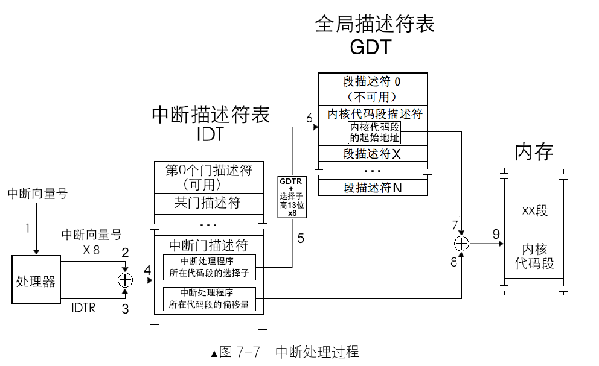
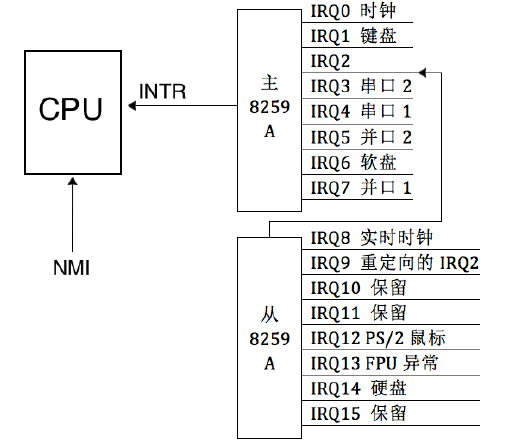
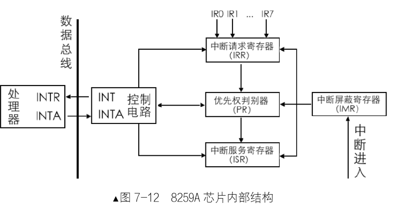
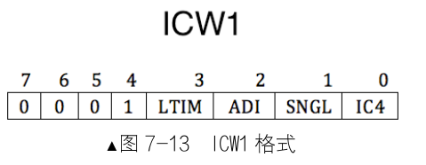
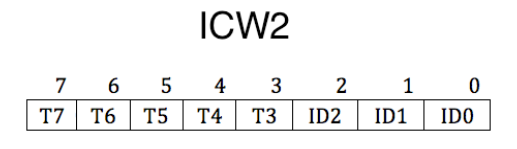
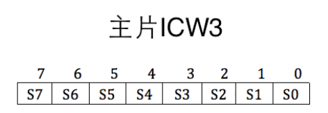
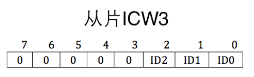
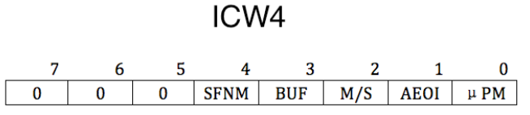
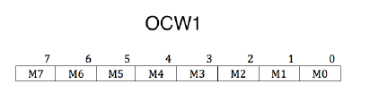
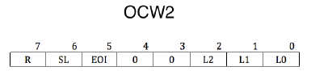

## 中断种类
### 1. 外部中断

外部中断又可以细分为可屏蔽中断和不可屏蔽中断。

### 2. 内部中断

内部中断可以分为**软中断**和**异常**。
软中断是由软件**主动**发起的中断，并不是发生了某种错误。
发起软中断的指令：
- `int 8位立即数`。常用于系统调用，可表示256种中断。
- `int3`。调试断点指令，中断向量号是3。我们常用的`gdb`或者`bochs`调试实际上就是使用到了这个指令。运行`gdb`的进程fork一个子进程用来运行被调试的程序，调试器打断点的本质是：将对应断点的地址的第一个字节备份并更改为`0xcc`，这样程序运行到断点处就会触发中断处理程序，运行中断处理程序之前要将当前的寄存器等数据压栈保存，查看寄存器或者变量实际上是从栈中获取的。
- `into`。中断溢出指令，中断向量号是4。在`eflags`寄存器的`OF`位为1的前提下触发中断。
- `bound`。数组索引越界检查指令，中断向量号是5。指令格式`bound 16/32位 内存/寄存器`，如果数据访问越界，则触发该中断。
- `ud2`。未定义指令，中断向量号是6。表示该指令CPU无法识别。

除了第一个是软中断外，其余是软中断，也可以认为是异常。因为它们既具备软中断的“主动”行为,又具备异常的“错误”结果。

异常可以分为三类：
1. Fault（故障）。比如缺页中断，这类异常交给对应的异常处理程序很大概率会被修复，甚至对操作系统有益处。
2. Trap(陷阱)。比如调试时候的`int3`，掉入了CPU设下的陷阱，很形象。
3. Abort(终止)。这是最严重的异常，意味着不可修复，操作系统为了正常运行，会直接将其从进程表中删除。通常是硬件出错或者内核某些数据结构出错。

## 中断描述符表

中断描述符表(Interrupt Descriptor Table,IDT)是保护模式下用于存储中断处理程序入口的表。由于操作系统是中断驱动的，实模式下存储中断的是中断向量表。

中断向量表和中断描述符表的区别？

- 中断描述符表地址不限制,在哪里都可以。
- 中断描述符表中的每个描述符用 8 字节描述。

## 中断处理过程以及保护

一个完整的中断包含CPU内部的CPU外部和CPU内部两个部分以及特权级的检查。

CPU 外:外部设备的中断由中断代理芯片接收,处理后将该中断的中断向量号发送到 CPU。
CPU 内:CPU 执行该中断向量号对应的中断处理程序。

这里只讨论CPU内部的过程：

1. 处理器根据中断向量号定位中断门描述符。
2. 处理器进行特权级检查。当前的特权级CPL必须在门描述符DPL和门中代码段描述符DPL之间（防止用户主动调用只为内核服务的例程）。

   1. 如果是由软中断 `int n`、`int3` 和 `into` 引发的中断,这些是用户进程中主动发起的中断,由用户代码控制,处理器要检查当前特权级 CPL 和门描述符 DPL,这是检查进门的特权下限,如果 CPL 权限大于等于 DPL,即数值上 CPL≤门描述符 DPL,特权级“门槛”检查通过,进入下一步的“门框”检查。否则,处理器抛出异常。
   2. 这一步检查特权级的上限(门框):处理器要检查当前特权级 CPL 和门描述符中所记录的选择子对应的目标代码段 DPL,如果 CPL 权限小于目标代码段 DPL,即数值上 CPL>目标代码段 DPL,检查通过。否则 CPL 若大于等于目标代码段 DPL,处理器将引发异常,也就是说,除了用返回指令从高特权级返回,特权转移只能发生在由低向高。
   3. 若中断是由外部设备和异常引起的,只直接检查 CPL 和目标代码段的 DPL,和上面的步骤2是一样的,要求 CPL 权限小于目标代码段 DPL,即数值上 CPL >目标代码段 DPL,否则处理器引发异常。

3. 执行中断处理程序。

由于IDT中会有中断门，陷阱门，任务门。中断发生时候会将NT位和TF位置为0。

NT位和TF位：
当 NT 标志被设置为 1 时，表示允许任务嵌套。设置为0表示进入了中断处理程序。这里还有个作用，`iret`指令既可以从新任务返回到旧任务，也可以从中断返回，这里 NT 标志就是区分到底是哪种返回。
当 TF 标志被设置为 1 时，会启用单步调试模式。设置为0也很容易想到，中断程序怎么会让你单步调试捏。

如果执行的是中断门时，会将IF位设置为0,避免中断嵌套，如果是陷阱门或者任务门则不会设置IF位为0，允许CPU响应更高级别的中断。当然也可以在中断处理程序中将IF位置为1,这样就可以处理优先级更高的中断。eflags寄存器有些位可以通过和栈配合来更改位，但是这有内存操作，效率低下且不是原子操作，所以专门给IF位提供了控制指令：`sti`开中断和`cli`关中断。IF 位(中断允许位)只能限制外部设备的中断,对那些影响系统正常运行的中断都无效,如异常 exception,软中断,如 int n 等,不可屏蔽中断 NMI 都不受 IF 限制。

### 中断发生时候的压栈

布拉布拉....

##  可编程中断控制器 8259A

最理想的方式是每个外设准备一个引脚接收中断，但是这明显不现实，成本高收益低。这时候一个中间层代理就显得智慧，这里使用的是Intel 8259A芯片。传统的PIC(就是可编程中断控制器 Programmable Interrupt Controller 的简称)是两片8259A风格的芯片级联的方式连接在一起。每个芯片可以处理8个不同的IRQ（中断请求）输入线，因为从PIC的INT输出线到主PIC的IRQ2引脚，因此可用的IRQ引脚只有`16 - 1`个。这种情况仅仅在系统只有一个CPU的情况下，将主芯片的输出引脚连接CPU的INTR引脚，但是系统有多个CPU就不适用了，引入了ACPI的新组件来代替老式的8259A芯片，这里只学习8259A芯片的原理和操作方式，不涉及多处理器的情况。
8259A可以管理和控制**可屏蔽中断**，它可以屏蔽外设中断，判断中断优先级，向CPU提供中断向量号，这些功能都是可编程的。 外接设备通过主板线路和8259A芯片连接在一起。下面是个人计算机中芯片级联方式：

### 内部结构

- INT: 芯片挑选出来优先级最高的中断请求，发信号给CPU。
- INTA: INT Acknowledge,中断响应信号。用于接收CPU的INTA接口的中断响应信号。
- IMR(Interrupt Mask Register): 中断屏蔽寄存器，8位，用来屏蔽某个外设的中断信号。
- IRR(Interrupt Request Register): 中断请求寄存器，8位，用来存储等待处理的中断。
- PR(Priority Resolver): 优先仲裁器，找出优先级最高的中断。
- ISR(In-Service Register): 中断服务寄存器，8位，存储正在处理的中断。

### 工作流程

1. 外设发出一个中断信号，通过主板线路将信号传递给芯片的某个IRQ接口。
2. 8259A首先检查IMR寄存器是否屏蔽了该IRQ接口的中断信号，如果为1则表示屏蔽，直接忽略。否则将其送入IRR寄存器，将其对应位置为1。
3. PR寄存器找出优先级最高的中断（这里优先级判断很简单，IRQ接口接口号越低，优先级越大）。
4. 芯片在控制电路中通过INT接口向CPU发送INTR信号，信号传入CPU的INTR接口后，CPU就知道有新的中断到来，执行完手里的指令就向自己的INTA接口向8259A回复一个中断响应信号，表示CPU准备就绪。
5. 8259A受到信号后，将刚才选出来的优先级最高的中断在ISR中置为1,同时将IRR中置为0。
6. CPU再次发送INTA信号，为了获取中断对应的中断向量号。
7. 如果8259A的EOI（End of Interrupt）被设置为手动模式，中断处理程序必须有向8259A发送EOI的代码，芯片受到EOI后会自动将ISR对应中断位置为0。

需要注意的是：并不是进入了 ISR 后的中断就高枕无忧了,它还是有可能被后者换下来的。比如,在 8259A 发送中断向量号给 CPU 之前,这时候又来了新的中断,如果它的来源 IRQ 接口号比 ISR 中的低,也就是优先级更高,原来 ISR 中准备上 CPU 处理的旧中断,其对应的 BIT 就得清 0,同时将它所在的 IRR中的相应 BIT 恢复为 1,随后在 ISR 中将此优先级更高的新中断对应的 BIT 置 1,然后将此新中断的中断向量号发给 CPU。

### 实际操作

说了那么多，我们最终目的很简单：
1. 构建IDT
2. 提供中断向量号

8259A内部有两组寄存器：初始化命令寄存器组(ICW1 ~ ICW4)，操作命令寄存器组(OCW1 ~ OCW3)。因此我们的操作也分为初始化和操作两部分。

#### 初始化

注意：ICW1 ~ ICW4的初始是有严格顺序的。必须依次写入 ICW1、ICW2、ICW3、ICW4。因为其中某些设置是由关联，依赖的。
##### ICW1

用来初始化 8259A 的连接方式和中断信号的触发方式。连接方式是指用单片工作,还是用多片级联工作,触发方式是指中断请求信号是电平触发,还是边沿触发。

IC4：表示是否写入ICW4,该位为1表示需要在后面写入ICW4,为0则不需要。x86必须设置为1。
SNGL：该位为1,表示是单片，为0则表示级联。
ADI：用来设置8259A的调用时间间隔，x86不需要设置。
LTIM：表示中断检测方式，为0表示边沿触发，为1表示电平触发。
第四位恒定为1。
第5~7位专用于8085处理器，x86不需要，设置为0。

##### ICW2

用来设置起始中断向量号。需要写入主片的0x21端口和从片的0xA1端口。
我们只需要写高五位的T3~T7，所以任意数字都是8的倍数，这个数字便是设定的起始中断向量号。第三位可以表示8个中断向量号，这是根据8259A芯片自行导入，这样就能表示任意一个IQR接口实际分配的中断向量号。

##### ICW3
在级联的前提下才能使用，用来设置主从片用哪个IRQ接口互联。需要写入主片的0x21端口和从片的0xA1端口。
对于主片，哪个IRQ接口用于连接从片，就将其设置为1（可以设置多个从片），设置为0表示是外接设备。
对于从片，只需要在从片上指定主片用于连接自己的IRQ接口。这样中断发生后，主片会发送与从片做级联的 IRQ 接口号,所有从片用自己的 ICW3 的低 3 位和它对比,若一致则认为是发给自己的。高五位没用到，设置为0。

##### ICW4

SFNM 表示特殊全嵌套模式(Special Fully Nested Mode) ,若 SFNM 为 0,则表示全嵌套模式,若 SFNM为 1,则表示特殊全嵌套模式。
BUF 表示本 8259A 芯片是否工作在缓冲模式。BUF 为 0,则工作非缓冲模式,BUF 为 1,则工作在缓冲模式。
当多个 8259A 级联时,如果工作在缓冲模式下,M/S 用来规定本 8259A 是主片,还是从片。若 M/S 为 1 ,则表示则表示是主片,若 M/S 为 0,则表示是从片。若工作在非缓冲模式(BUF 为 0)下,M/S 无效。
AEOI 表示自动结束中断(Auto End Of Interrupt) ,8259A 在收到中断结束信号时才能继续处理下一个中断,此项用来设置是否要让 8259A 自动把中断结束。若 AEOI 为 0,则表示非自动,即手动结束中断,咱们可以在中断处理程序中或主函数中手动向 8259A 的主、从片发送 EOI 信号。这种“操作”类命令,通过下面要介绍的 OCW 进行。若 AEOI 为 1,则表示自动结束中断。
μPM 表示微处理器类型(microprocessor) ,此项是为了兼容老处理器。若 μPM 为 0,则表示 8080 或8085 处理器,若 μPM 为 1,则表示 x86 处理器。

#### OCW

##### OCW1

需要写入主片的0x21端口和从片的0xA1端口。
OCW1 用来屏蔽连接在 8259A 上的外部设备的中断信号，还记得上面说的IMR(Interrupt Mask Register)吗？实际上就是将OCW1的数据填入该寄存器中。为1表示该位被屏蔽。

##### OCW2

OCW2 要写入到主片的 0x20 及从片的 0xA0 端口。
OCW2 用来设置中断结束方式和优先级模式。

SL：Specific Level,表示是否指定优先等级。等级是用低 3 位来指定的。此处的 SL 只是开启低 3 位的开关,所以 SL 也表示低 3 位的 L2~L0 是否有效。SL 为 1 表示有效,SL 为 0 表示无效。

OCW2 其中的一个作用就是发 EOI 信号结束中断。如果使 SL 为 1,可以用 OCW2 的低 3 位(L2~L0)来指定位于 ISR 寄存器中的哪一个中断被终止,也就是结束来自哪个 IRQ 接口的中断信号。如果 SL 位为 0,L2~L0 便不起作用了,8259A 会自动将正在处理的中断结束,也就是把 ISR 寄存器中优先级最高的位清 0。

R：用来设置优先级控制方式。为0，则IRQ接口号越低，优先级越高。
R为1:设置为循环优先级方式。
1. SL为0，初始优先级次序为IR0>IR1>IR2>IR3>IR4>IR5>IR6>IR7。
2. SL为1,通过 L2~L1 指定最低优先级是哪个 IRQ 接口。
举个例子,在 R 和 SL 都等于 1 的情况下,若想指定 IR5 为最低的优先级,需要将 L2~L0 置为 101。
这样,新的初始优先级循环是:IR6>IR7>IR0>IR1>IR2>IR3>IR4>IR5。什么是循环优先级方式？当前 IR6 为最高级别中断请求,处理完成后,IR6 将变成最低级别,IR7 变成最高级别,这一组循环之后的优先级变成了:IR7>IR0>IR1>IR2>IR3>IR4>IR5>IR6。

EOI：End Of Interrupt,为中断结束命令位。令 EOI 为 1,则会令 ISR 寄存器中的相应位清 0,也就是
将当前处理的中断清掉,表示处理结束。向 8259A 主动发送 EOI 是手工结束中断的做法,所以,使用此
命令有个前提,就是 ICW4 中的 AEOI 位为 0,非自动结束中断时才用。

OCW3用于设定特殊的屏蔽方式以及查询方式。

#### 编写中断处理程序

